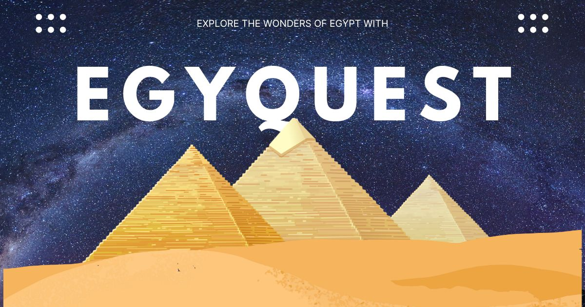

# Egyquest 𓋹

Embark on an immersive journey to ancient Egypt from the comfort of your home with [Egyquest](https://andronasef.github.io/egyquest). This web application allows you to explore the wonders of this legendary civilization through a virtual tour of its most famous landmarks, including the majestic pyramids and mystical temples.

## Idea 💡

What I was thinking is to make a directory of Egypt places and display some images and facts to every place but Thanks to [@nealagarwal](https://twitter.com/nealagarwal) to I came up with the idea (of make it all about Google Street View) for my website after being inspired by [Neal.Fun's](https://neal.fun/) tool, [Wonders of Google Street](https://neal.fun/wonders-of-street-view/).

## How to use ? 🤔

To use Egyquest, simply navigate to the [website](https://andronasef.github.io/egyquest) and start exploring! No sign-up or login is required.

## Technologies 💻

### Frontend

- React
- Redux
- Tailwind
- Float UI

### Backend

- Google Script + Google Sheets

How!? => I created a straightforward API using Google Script, which retrieves data from Google Sheets and produces a JSON response containing information about each location.

## Contributing 🤝

- Share Egyquest with your friends and family.
- Suggest new features for Egyquest.
- Report any bugs or issues you encounter.
- Provide feedback on your experience using Egyquest.
- Propose other ideas for Egyquest.
